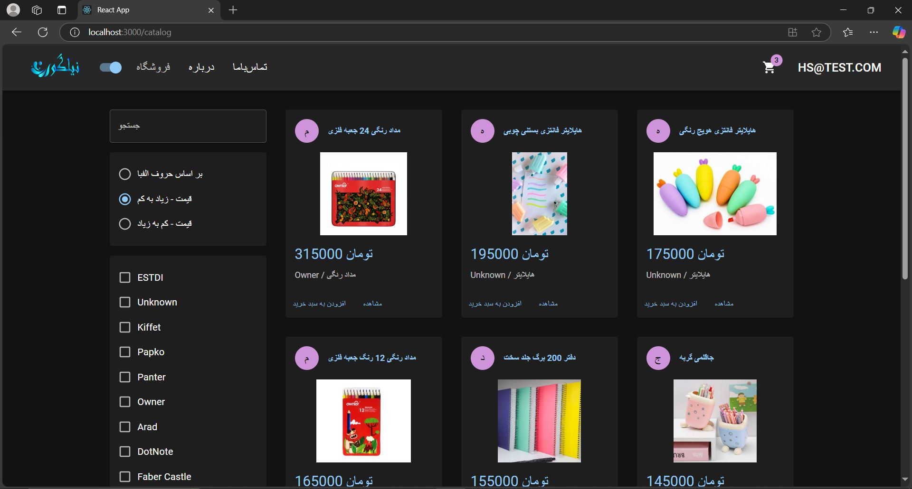
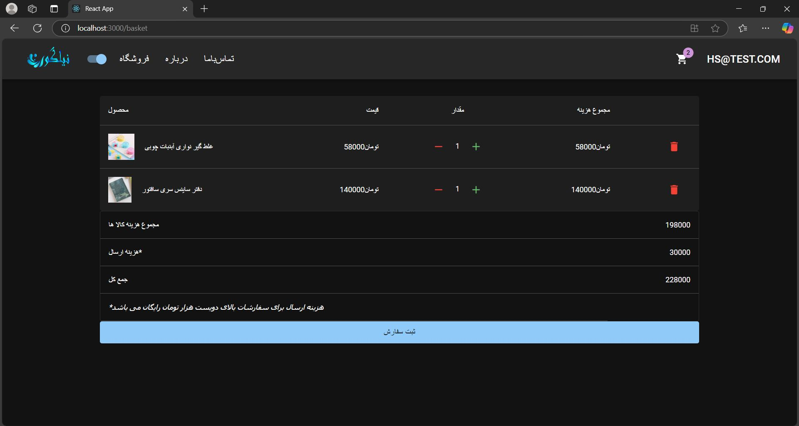
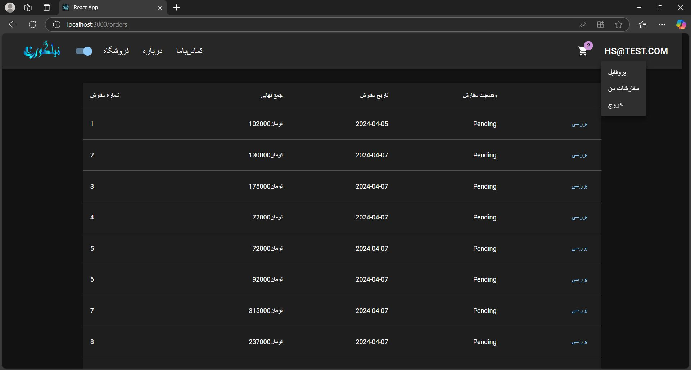

# 🛒 Stationery Shop Website

This is a simple e-commerce web application for a stationery store, built as my first personal project. It’s a work in progress, mainly focused on learning backend development using ASP.NET and Entity Framework, along with frontend work in React.

## ✨ Features (Completed So Far)

- User registration and login
- Product listing page
- Product details view
- Shopping cart (basic)
- Database connection with SQL Server
- Backend API built with ASP.NET
- Frontend with React

## 🛠️ Technologies Used

- ASP.NET
- Entity Framework (EF)
- SQL Server
- React
- JavaScript
- HTML/CSS

## 📌 Upcoming Features

- Admin panel for managing products
- Payment integration
- Better error handling

## 🖼️ Screenshots

## Screenshots

## 🚧 Project Status

This is an ongoing learning project. I'm working on it and improving both the backend and frontend as I learn more.

## 🙋‍♀️ About Me

I'm a computer engineering graduate passionate about backend development and data. This is my first solo project, and I'm excited to keep building and learning!

